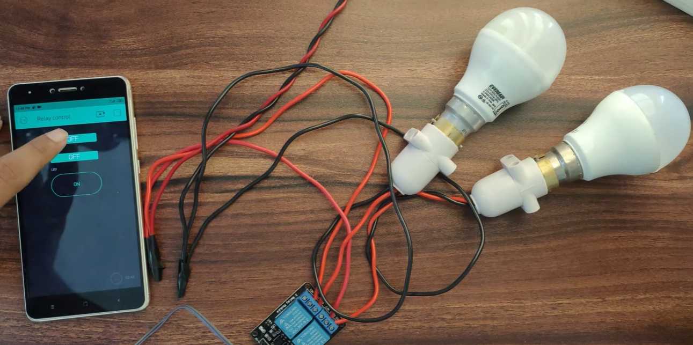
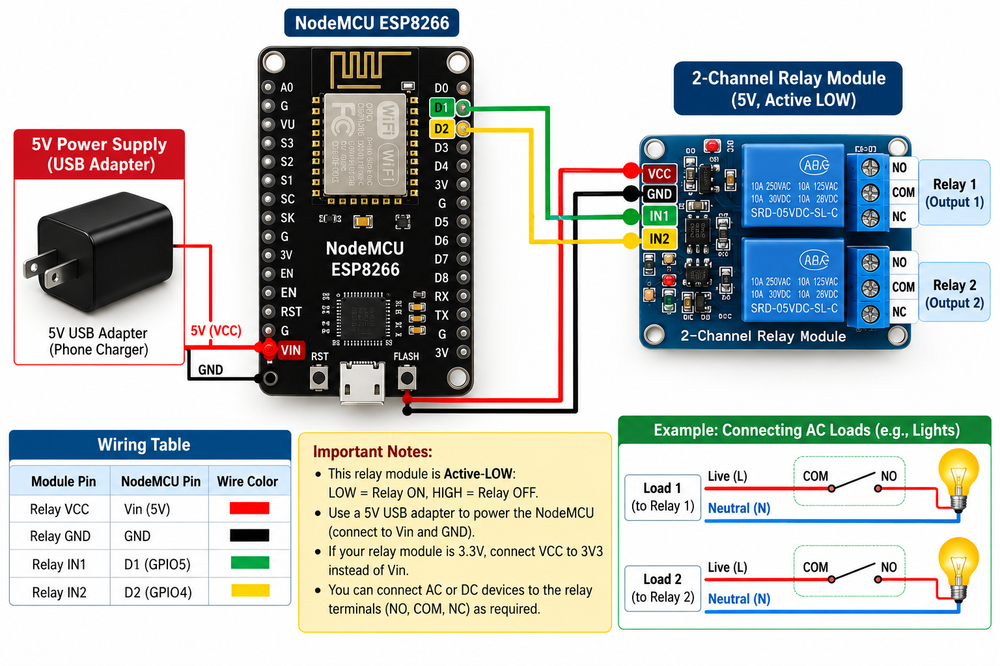
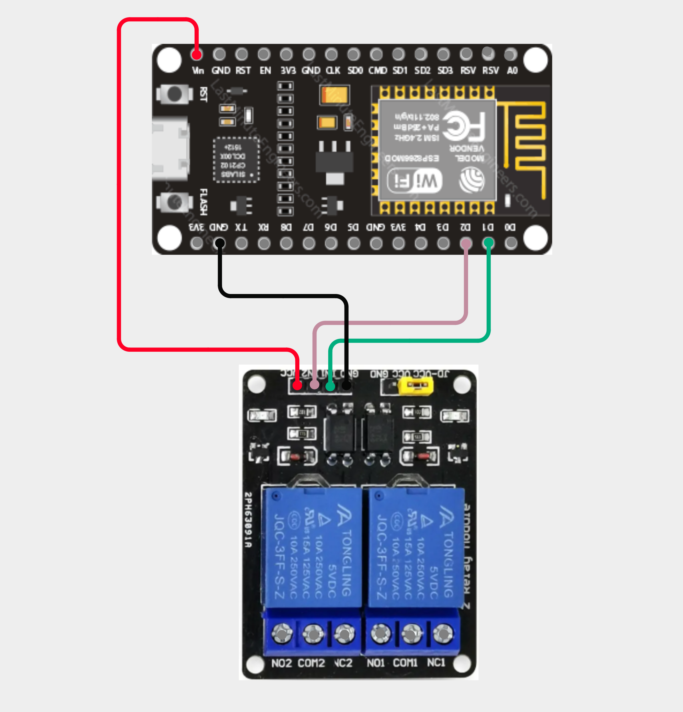

# Home Automation with ESP8266 and Blynk

A simple Wi-Fi home automation system that switches two appliances on and off from a phone. A NodeMCU ESP8266 connects to the Blynk IoT cloud and drives a 2-channel relay module, so each relay can be controlled from its own switch in the Blynk app, from anywhere with an internet connection.

> **Status:** Working prototype

## Demo

<!-- Add a photo of your own setup here:  -->

## Features

- Two independent relay channels, each controlled by its own switch in the Blynk app
- Works over Wi-Fi from anywhere, not only on the home network
- Both relays start in the OFF state every time the board powers up, so nothing switches on by itself after a power cut
- Short, readable code of about 20 lines of logic

## Components

| Component | Qty | Purpose |
|---|---|---|
| NodeMCU ESP8266 | 1 | Wi-Fi controller |
| 2-channel relay module (5 V, active-LOW) | 1 | Switches the two loads |
| 5 V USB adapter | 1 | Powers the NodeMCU and the relay module |
| Jumper wires | - | Connections |
| Loads (lamp, fan or similar) | 2 | Appliances to control |
| Blynk IoT app | - | Phone dashboard |

## Circuit

| Relay module pin | NodeMCU pin |
|---|---|
| VCC | Vin (5 V) |
| GND | GND |
| IN1 | D1 (GPIO5) |
| IN2 | D2 (GPIO4) |

Each load is connected to the relay's COM and NO terminals, so the load is off until the relay is switched on. D1 and D2 are used because they are safe pins at start-up.

## How it works

1. The NodeMCU connects to Wi-Fi and to the Blynk cloud using the auth token.
2. When you flip a switch in the app, Blynk sends the new value (0 or 1) to the board on virtual pin V0 for relay 1, or V1 for relay 2.
3. The code sets the matching relay pin. This relay module is active-LOW, so a LOW signal switches the relay ON and a HIGH signal switches it OFF.

## Blynk setup

| Virtual pin | Use | Widget |
|---|---|---|
| V0 | Relay 1 | Switch |
| V1 | Relay 2 | Switch |

1. Create a Blynk template and a device.
2. Create two datastreams, V0 and V1, both Integer from 0 to 1.
3. Add two Switch widgets, one linked to each datastream.

## Code

The full sketch is in [`code/code.ino`](code/code.ino).

To run it:

1. Open the file in the Arduino IDE. The ESP8266 board package and the Blynk library must be installed.
2. Replace the placeholders at the top with your Blynk template ID, auth token, Wi-Fi name and Wi-Fi password.
3. Select **Board: NodeMCU 1.0 (ESP-12E Module)** and the correct port, then upload.
4. Open the Blynk app and use the two switches.

Never upload your real auth token or Wi-Fi password to GitHub. Keep the placeholders in the public copy.

## Safety

Mains voltage can kill. For a demo, switch a low-voltage load such as a 12 V bulb or an LED strip. Wire any mains appliance only if you know how to do it safely, keep the connections inside a closed enclosure, and never touch the relay terminals while the system is plugged in.

## Limitations

- If your relay module works the opposite way (active-HIGH), swap `LOW` and `HIGH` in the code.
- The relays always start OFF after a restart. The app does not remember the last state.
- Control needs an internet connection. There is no manual switch as a backup.

## Possible improvements

- Add physical push buttons so the loads can also be switched by hand
- Add more relay channels with a 4-channel or 8-channel module
- Add schedules and timers in Blynk
- Add a temperature sensor so a fan switches on automatically
